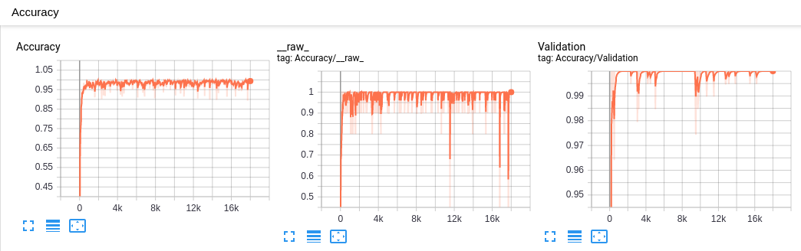

# digits_sounds_recognizer
Simple NN model for recovering Cantonese digits to text  (99% Accuracy after 100 epoch)
```
--
Training Step: 18000  | total loss: 0.20440 | time: 2.408s
| Adam | epoch: 100 | loss: 0.20440 - acc: 0.9911 | val_loss: 0.00000 - val_acc: 1.0000 -- iter: 1800/1800
--
```


# Installation on ubuntu
```bash
$ sudo apt-get install libasound2-dev
$ pip3 install -r requirements.txt
```

# Predict
```bash
$ python predict.py ./data/4999.mp3
Prediction for ./data/4999.mp3 = 9972
```

# Train
```bash
$ python train.py
```

# Fetch more samples & perform labelling manually
```bash
$ node samples_collector.js
$ python 4-digits-audio-splitter-and-labeler.py
$ python generate-data-summary-csv.py
```